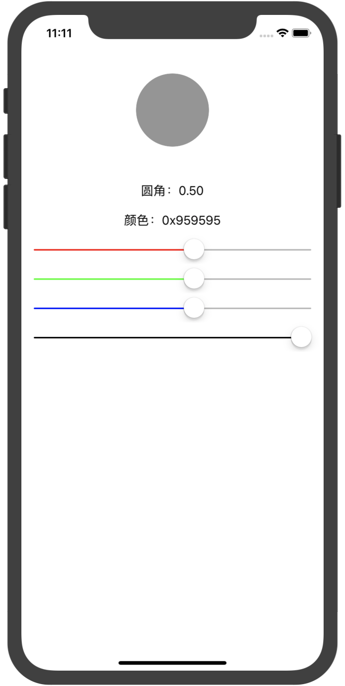

# HBUIKit

## Usage
``` Objective-C
#import "HBUIKit.h"
``` 
## Example
Objective-C使用快捷设置UIView的frame中的x,y,width,height,origin,size的设置示例代码如下：
 
``` Objective-C    
UIView *view = ...;
view.hb_x = 100;
view.hb_y = 100;
view.hb_width = 100;
view.hb_height = 100;
view.hb_origin = CGPointMake(50,50);
view.hb_size = CGSizeMake(50,50);
``` 
    
使用UIColor的十六进制颜色值或者0~255的RGB数值示例代码如下：
``` Objective-C
UIColor *hexStringColor = [UIImage HBImageWithColor:[UIColor HBColorWithHexString:@"0x00F5FF"];
UIColor *hexIntColor = [UIImage HBImageWithColor:[UIColor HBColorWithHexInt:0x00F5FF];
UIColor *rgbColor = [UIColor HBColorWithRed:122 green:34 blue:90];
```
   
UIImage生成圆角图片，切割图片示例代码如下：    
``` Objective-C
UIImage *circleImage = [UIImage HBImageWithColor:[UIColor whiteColor] imageSize:(CGSize){100,100} cornerRadius:50];
UIImage *cropImage = [circleImage HBCropImageInRect:(CGRect){0,0,30,30}];
UIImage *resizedImage = [circleImage HBResizeImageToSize:(CGSize){50,50}];
```
   
使用Tag值快速创建UIView：
``` Objective-C
UIView *circleView = [UIView HBViewWithTag:1807];
circleView.frame = (CGRect){0,80,200,200};
circleView.layer.contents = (__bridge id)[UIImage HBImageWithColor:[UIColor HBColorWithHexString:@"0x959595"] imageSize:circleView.hb_size cornerRadius:circleView.hb_width/2].CGImage;
circleView.hb_x = (self.view.hb_width - circleView.hb_width) / 2;
[self.view addSubview:circleView];
```
使用Text，TextColor快速创建UILabel：
``` Objective-C
UILabel *radiusLbl = [UILabel HBLabelWithText:@"圆角：0.50" textColor:[UIColor blackColor]];
radiusLbl.tag = 1806;
radiusLbl.hb_x = (self.view.hb_width - radiusLbl.hb_width) / 2;
radiusLbl.hb_y = circleView.hb_maxY+50;
[self.view addSubview:radiusLbl];
```
## Author
1021580211@qq.com